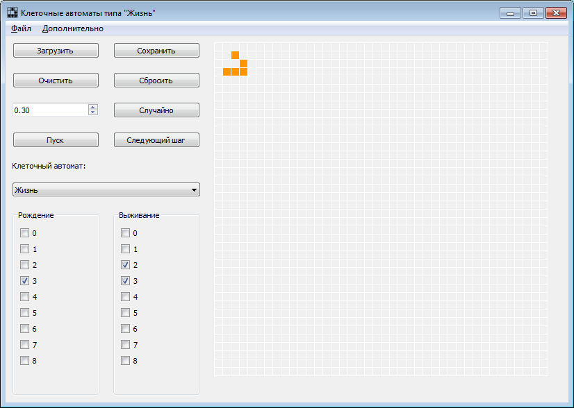
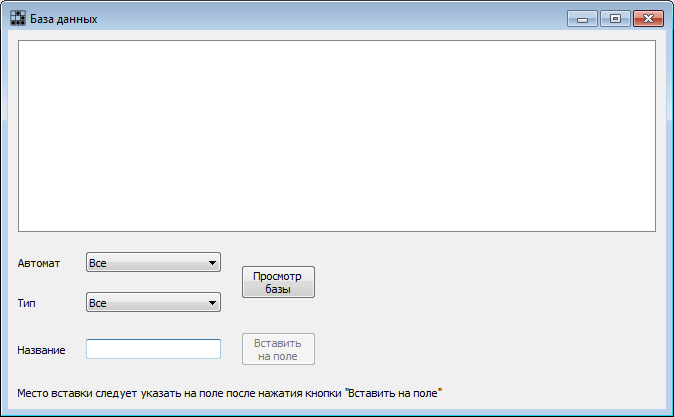
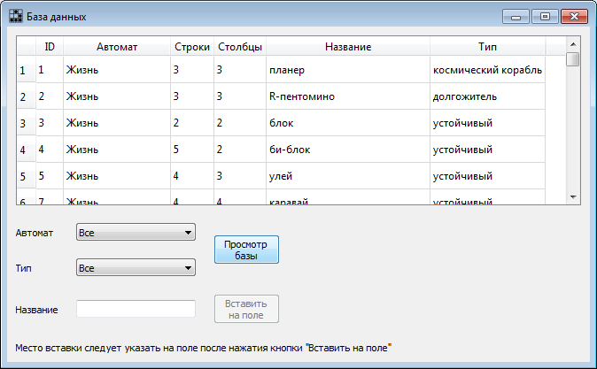
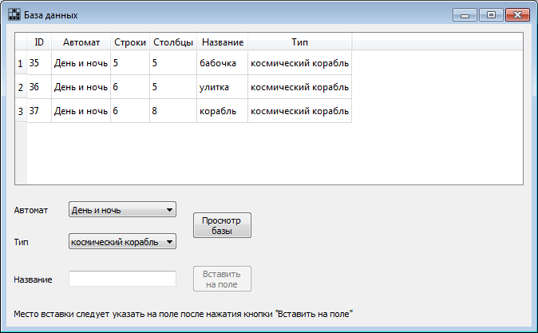
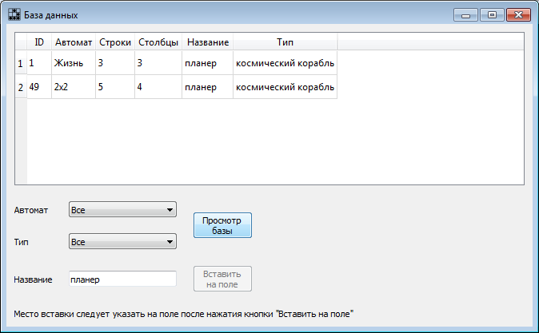
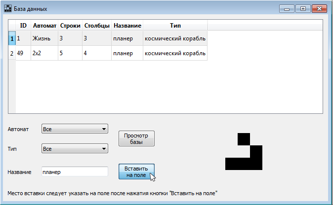
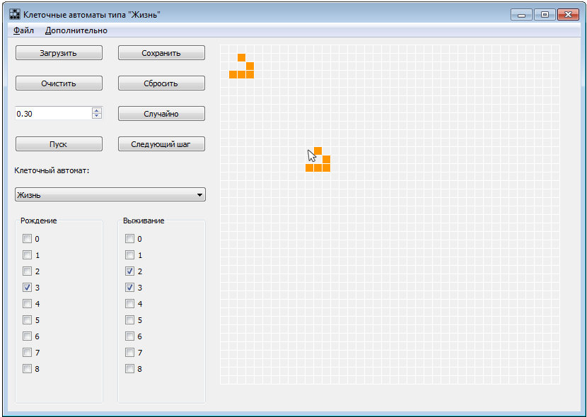
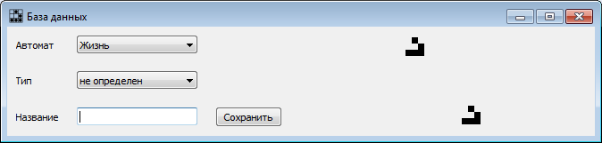
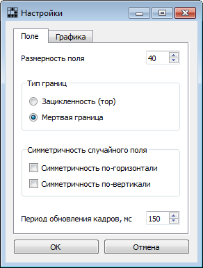
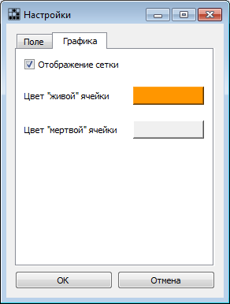

<h1 align="center">Клеточные автоматы типа "Жизнь"</h1>

## Описание программы

### Описание идеи

Программа выполняет анимацию работы клеточных автоматов типа "Жизнь". 

Клеточный автомат типа "Жизнь" — двумерная дискретная модель. Включает регулярную решётку ячеек, каждая из которых может находиться в одном из двух состояний: "живая" и "мертвая". Решетка может быть любой размерности, но в данной программе рассмотрены квадратные решетки. 

Для работы клеточного автомата требуется задание начального состояния всех ячеек и правил перехода ячеек из одного состояния в другое. На каждой итерации, используя правила перехода и состояния соседних ячеек, определяется новое состояние каждой ячейки. Правила перехода одинаковы для всех ячеек и применяются сразу ко всей решётке. 

Правило перехода задано в виде двух компонент: число "живых" соседей, при которых в клетке зарождается жизнь, и число "живых" соседей, при которых "живая" клетка сохраняет свое состояние (выживает). Соседними считаются все ячейки, касающиеся текущей, в том числе углами (по диагонали), число "живых" соседей может быть от 0 до 8. 

Подробнее о клеточных автоматах типа "Жизнь":
<a>https://en.wikipedia.org/wiki/Life-like_cellular_automaton</a>

### Возможности программы

Программа позволяет просматривать эволюцию конфигураций клеточных автоматов типа "Жизнь" - как пошагово, так и в виде анимации.

Правила перехода клеточного автомата могут быть заданы вручную или выбраны из имеющихся. Начальная конфигурация может быть задана вручную. Возможно равномерное заполнение поля случайным образом с заданной вероятностью (в том числе симметричное заполнение).

Возможна загрузка конфигураций из базы данных на поле в заданную ячейку и сохранение конфигурации, изображенной на поле, в базу данных. 

В настройках можно задать параметры поля: размерность, поведение на границе поля ("мертвые" ячейки на границе или зацикленность поля по тору), симметричность случайного заполнения, графические настройки. При выходе из программы изменения в настройках сохраняются и загружаются при следующем запуске программы.

## Техническое задание

### Цель создания программы
Упростить процесс моделирования методом клеточных автоматов типа "Жизнь", в том числе: 
- поиск конфигураций с интересной эволюцией, например, с помощью задания случайного стартового распределения
- просмотр результатов в виде анимации
- сохранение интересных конфигураций

### Функциональные требования
- Анимация эволюции конфигурации, как автоматическая, так и пошаговая ручная
- Задание начальной конфигурации различными способами: в ручном режиме, случайное с заданной вероятностью, сборка из готовых конфигураций
- Сохранение конфигурации в базу данных с описанием конфигурации
- Просмотр и загрузка сохраненных конфигураций
- Задание правил перехода клеточного автомата
- Задание поведения на границе поля, возможность задания зацикленности и "мертвой" границы

### Нефункциональные требования 

#### Интерфейс пользователя
- Взаимодействие с пользователем должно быть полностью организовано через оконный графический интерфейс
- Графический интерфейс пользователя должен быть реализован с помощью библиотеки PyQT5
- Программа должна содержать минимум два окна

#### Требования к надежности
- Необходимо предусмотреть контроль вводимой информации
- Необходимо предусмотреть блокировку некорректных действий пользователя при работе с программой
- Необходимо обеспечить корректность редактирования данных с помощью их хранения в виде базы данных

#### Требования к производительности
- Программа должна стабильно работать при большом размере поля, конфигураций, большом размере базы данных
- Загрузка из базы данных и сохранение в базу данных не должно превышать 15 секунд
- Процесс загрузки программы не должен превышать 30 секунд
- Процесс загрузки окна не должен превышать 5 секунд
 

## Руководство пользователя

### Задание конфигурации

- **Клик по полю** меняет статус ячейки: "живая" - "мертвая". Можно создать собственную конфигурацию.
- Кнопка **Случайно** позволяет задать случайное распределение на всем поле. Вероятность появления "живой" ячейки задается в виджете слева от кнопки.
- Кнопка **Очистить** или пункт меню **Файл - Новый** заполняет все поле "мертвыми" ячейками
- Кнопка **Загрузить** позволяет выбрать конфигурацию в базе данных и вставить ее в указанную ячейку поля. Подробнее см. **Загрузка и сохранение**

### Задание правил перехода

Правила перехода клеточного автомата могут быть заданы в виде известного автомата из выпадающего списка
Возможно задание вручную в виде двух наборов флажков: число "живых" соседей, при которых в клетка становится "живой", и число "живых" соседей, при которых "живая" клетка сохраняет свое состояние.

### Просмотр эволюции

- Кнопка **Следующий шаг** отображает на поле следующее поколение автомата.
- Кнопка **Пуск** запускает анимацию смены поколений автомата. Анимация останавлвается по нажатию кнопки **Пауза**
- Кнопка **Сбросить** восстанавливает исходное состояние конфигурации - состояние перед расчетом первого поколения эволюции или перед очисткой поля.

### Загрузка из базы данных

Кнопкой **Загрузить** или пунктом меню **Файл - Загрузить** открывается окно **База данных** для просмотра и вставки конфигурации из базы данных.
 
- Кнопка **Просмотр базы** загружает сохраненные конфигурации в таблицу в верхней части окна. 

- Перед загрузкой можно настроить фильтры для выгрузки конфигураций по заданным критериям
 
- **Клик по строке таблицы** выделяет конфигурацию и показывает ее вид в зоне предпросмотра 

- Для размещения выбранной конфигурации на поле нужно нажать кнопку **Вставить на поле** и после закрытия окна базы данных кликнуть на ячейку поля для размещения конфигурации (по верхнему левому углу прямоугольника, окружающего конфигурацию) 
 

### Сохранение в базу данных

Кнопкой **Сохранить** или пунктом меню **Файл - Сохранить** открывается окно **База данных** для сохранения конфигурации в базу данных.
 
 
В сохраняемую конфигурацию включаются все живые клетки на поле.

Перед сохранением нужно указать тип конфигурации в выпадающем списке и название конфигурации в текстовом поле. Также можно изменить тип автомата. Если правило автомата задавалось вручную, по умолчанию в базу сохраняется автомат "Жизнь". Если закрыть окно без нажатия кнопки **Сохранить**, сохранение не будет выполнено. 

### Настройки 

Пунктом меню **Дополнительно - Настройки** открывается окно **Настройки**.

- Во вкладке **Поле** задаются параметры поля клеточного автомата: размерность поля, поведение на границах, задержка между кадрами при анимации. 

Поведение на границах может быть в двух вариантах: поле зациклено как тор (левая граница соединена с правой, верхняя с нижней) либо на границе расположены мертвые клетки. В последнем случае "мертвая" граница слева и сверху не отображается, а справа и снизу отображается, т.е. клетки в последней строке и последнем столбце гарантированно станут "мертвыми" при расчете следующего поколения.

- Во вкладке **Графика** можно изменить цвет ячеек поля и отображение сетки на поле.

- При нажатии кнопки **ОК** произойдет очистка поля и изменение его параметров, даже если изменений в настройках не было. При закрытии окна или нажатии кнопки **Отмена** изменения в настройках не сохранятся и очистки поля не произойдет. При выходе из программы текущие настройки сохраняются и будут восстановлены при последующем запуске программы.

### Справка

Кнопкой **Справка** или пунктом меню **Дополнительно - Справка** открывается справочное окно с краткой информацией о программе.

## Программные требования

Программа написана на языке Python3 и требует установленного интерпретатора для запуска.
Необходимые библиотеки Python3:
- numpy
- PyQt5
Для корректной работы программы нужно наличие файла базы данных Life_like_automatons.db, содержащей 3 таблицы. 

Структура базы данных:

    CREATE TABLE automatons (
    id       INTEGER PRIMARY KEY AUTOINCREMENT
                     NOT NULL
                     DEFAULT (0),
    name     STRING,
    birth    STRING,
    survival STRING
    );
    
    CREATE TABLE pattern_types (
    id   INTEGER PRIMARY KEY AUTOINCREMENT,
    type STRING
    );
    
    CREATE TABLE patterns (
    id        INTEGER PRIMARY KEY AUTOINCREMENT,
    automaton INTEGER REFERENCES automatons (id),
    rows      INTEGER,
    columns   INTEGER,
    name      STRING,
    pattern   STRING,
    type      INTEGER REFERENCES pattern_types (id) 
    );
   

   
## Установка и запуск

Программа содержит основной запускаемый модуль main.py и набор модулей в директории modules, описывающих дополнительные окна и виджеты и подгружаемых автоматически.

В директории files содержатся файлы базы данных, json-хранилища настроек программы и изображение иконки.

База данных содержит примеры конфигураций для демонстрации возможностей программы. 

Установки программы не требуется. Для запуска программы следует запустить в интерпретаторе (с установленными требуемыми библиотеками) файл main.py.

## Дальнейшее развитие

- Добавить автоматизацию перебора конфигураций с выделением невырожденных случаев.
- Добавить выполнение манипуляций над конфигурацией при вставке: отражение, поворот, транспонирование.
- Добавить выделение ячеек для перетаскивания по полю и сохранения выделенной конфигурации
